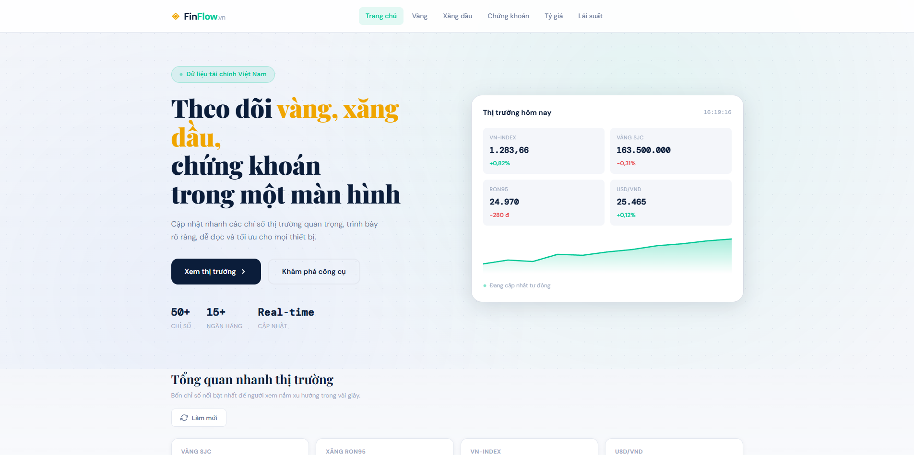

 # VietFuel API

[](https://nodejs.org/)
[](https://expressjs.com/)
[](LICENSE)

Real-time Vietnam fuel prices and gold prices API with multi-source data aggregation.

## Overview

**VietFuel API** is a Node.js REST API that aggregates fuel and gold prices from multiple Vietnamese data sources. Built for financial market tracking applications, it provides reliable data with intelligent caching, automatic updates, and province-level price lookup.

## Preview

<p align="center">
  
</p>

### Key Features

- **Multi-source fuel price aggregation** from Petrolimex, PVOil, Mipec, Saigon Petro, COMECO, PetroTimes, WebGia, and GiaXangHomNay
- **Real-time gold prices** with short-term caching to minimize external API load
- **Province-level price lookup** with automatic on-demand scraping (60+ Vietnamese provinces)
- **Intelligent caching** with in-memory cache + `cache.json` fallback for zero downtime
- **Adaptive scheduled updates** with timezone-aware cron jobs (optimized for Vietnam's fuel price announcement schedule)
- **Production-ready API** with rate limiting, CORS, compression, and security headers
- **Zero-config setup** — works out of the box with sensible defaults

## Tech Stack

| Layer | Technology |
|-------|-----------|
| **Runtime** | Node.js >=18 |
| **Framework** | Express 5 |
| **Data Scraping** | Playwright, custom HTML parsers |
| **Caching** | node-cache + persistent JSON fallback |
| **Scheduling** | node-cron (Asia/Ho_Chi_Minh timezone) |
| **Security** | helmet, CORS, express-rate-limit |
| **Logging** | Winston |
| **Testing** | Node test runner |

## Quick Start

### Prerequisites

- **Node.js** `>=18` and **npm**
- **Chromium browser** (automatically installed by Playwright)

### Installation

```bash
# Clone repository
git clone https://github.com/chidungho/vietfuel-api.git
cd vietfuel-api

# Install backend dependencies
npm --prefix "gia thi truong xang dau/vietfuel-api/backend" install

# Install Playwright browsers
npm run browser:install

# Start development server with auto-scraping
npm run dev
```

Server will run on `http://localhost:3000`

### Environment Setup (Optional)

Create a `.env` file in the backend directory for custom configuration:

```bash
cp "gia thi truong xang dau/vietfuel-api/backend/.env.example" \
   "gia thi truong xang dau/vietfuel-api/backend/.env"
```

## Configuration

| Variable | Default | Description |
|----------|---------|-------------|
| `PORT` | `3000` | HTTP server port |
| `NODE_ENV` | `development` | Environment mode (`development` or `production`) |
| `CACHE_TTL_MINUTES` | `60` | Fuel price cache TTL in minutes |
| `GOLD_CACHE_TTL_SECONDS` | `300` | Gold price cache TTL in seconds |
| `CRON_SCHEDULE` | `"0 * * * *"` | Auto-scrape schedule (cron format, 1 hour) |
| `SKIP_BOOTSTRAP_JOBS` | `false` | Skip auto-scraping on startup (useful for testing) |

**Skip auto-scraping on startup:**

```bash
# PowerShell
$env:SKIP_BOOTSTRAP_JOBS="true"
npm run dev

# Bash
SKIP_BOOTSTRAP_JOBS=true npm run dev
```

## API Endpoints

### Fuel Prices

**Get aggregated fuel prices** (default source)

```http
GET /api/fuel-prices
```

**Response Example:**

```json
{
  "success": true,
  "status": "ok",
  "disclaimer": "...",
  "meta": {
    "primarySourceId": "giaxanghomnay",
    "primarySource": "GiaXangHomNay",
    "primarySourceUrl": "https://giaxanghomnay.com",
    "dataSources": ["giaxanghomnay", "petrolimex", "pvoil"],
    "sourceCount": 3,
    "scrapedAt": "2026-05-17T10:30:00Z",
    "priceDate": "2026-05-17",
    "cacheHit": true,
    "cacheTtlRemainingSeconds": 1800,
    "isStale": false,
    "totalItems": 7
  },
  "data": [
    {
      "name": "Xăng RON 95-V",
      "region1": 24650,
      "region2": 25140,
      "price": null,
      "unit": "VND/lít"
    },
    {
      "name": "DO 0,001S-V",
      "region1": 29430,
      "region2": 30010,
      "price": null,
      "unit": "VND/lít"
    }
  ]
}
```

**Refresh fuel data** (force scrape):

```http
GET /api/fuel-prices?refresh=1
```

**Get fuel prices by source**

```http
GET /api/fuel-prices/{source}
```

Available sources: `petrolimex`, `kv2_petrolimex`, `saigon_petrolimex`, `vungtau_petrolimex`, `pvoil`, `mipec`, `comeco`, `saigonpetro`, `petrotimes`, `webgia`, `giaxanghomnay`

Example: `GET /api/fuel-prices/pvoil`

**Get fuel prices by province**

```http
GET /api/fuel-prices/province/{slug}
```

Example: `GET /api/fuel-prices/province/ha-noi`

### Gold Prices

**Get gold prices**

```http
GET /api/gold-prices
```

**Filter by gold type**

```http
GET /api/gold-prices?type=SJC
GET /api/gold-prices?type=DOJI
```

### Metadata

**List all provinces**

```http
GET /api/provinces
```

**Filter provinces by region**

```http
GET /api/provinces?region=1
GET /api/provinces?region=2
```

**List data sources with cache status**

```http
GET /api/sources
```

**Health check**

```http
GET /api/health
```

Returns cache status for all sources and endpoint statistics.

## Project Structure

```
vietfuel-api/
├── gia thi truong xang dau/
│   ├── index.html                 # Frontend (standalone HTML app)
│   ├── style.css
│   ├── script.js
│   └── vietfuel-api/
│       └── backend/
│           ├── index.js           # App entry point
│           ├── server.js          # Express server
│           ├── package.json
│           ├── .env.example       # Configuration template
│           ├── cache.json         # Persistent fallback cache
│           ├── config/
│           │   └── index.js       # Configuration loader
│           ├── data/
│           │   └── provinces.json # Province database
│           ├── routes/
│           │   └── fuel.js        # API route handlers
│           ├── services/
│           │   ├── cache.js       # Cache management
│           │   ├── gold.js        # Gold price fetcher
│           │   ├── scraper.js     # Main scraper orchestrator
│           │   └── scrapers/      # Source-specific parsers
│           │       ├── petrolimex.js
│           │       ├── pvoil.js
│           │       ├── mipec.js
│           │       ├── ... (8 more sources)
│           │       └── utils.js   # Scraper helpers
│           ├── utils/
│           │   ├── fuel-helpers.js  # API helpers
│           │   └── logger.js        # Winston logger
│           ├── workers/
│           │   └── jobs.js          # Cron job definitions
│           ├── logs/                 # Application logs
│           └── tests/
│               ├── playwright-missing.test.js
│               └── server-static.test.js
└── README.md
```

## Development

### Run Tests

```bash
npm test
```

### Run Scraper (Manual)

```bash
npm run scrape
```

### Development Server (with auto-reload)

```bash
npm run dev
```

### Production Server

```bash
npm start
```

## How It Works

1. **Startup**: Express server loads configuration, initializes cache, and starts scheduled jobs
2. **Scheduled Updates**: `node-cron` periodically scrapes fuel prices from configured sources (default: every hour)
3. **Scraping**: Playwright launches headless Chromium to parse HTML from multiple fuel retailers
4. **Caching**: Scraped data is stored in-memory (`node-cache`) and persisted to `cache.json` as fallback
5. **API Requests**: Incoming requests are served from cache with optional refresh (`?refresh=1`)
6. **Province Lookup**: On-demand scraping for specific provinces if not cached
7. **Gold Prices**: Integrated API calls to external gold price service with separate cache layer

## Performance & Reliability

- **Smart Caching**: In-memory + persistent JSON keeps API responsive even if all sources are down
- **Rate Limiting**: Built-in request throttling (60 req/min general, 20 req/min province lookups)
- **Timeout Handling**: Graceful degradation with stale cache fallback
- **Logging**: Request/error logging via Winston for monitoring
- **CORS & Security**: Helmet, CORS, and compression headers for production use

## Notes & Disclaimers

- Data is scraped from public websites; accuracy depends on source freshness
- Fuel prices are typically updated by Vietnam's government on specific dates (15th, 25th, or adjusted schedule)
- Gold prices update in real-time from vang.today API
- All times are in Vietnam timezone (`Asia/Ho_Chi_Minh`)
- Rate limits apply to prevent abuse; adjust in routes as needed

## Contributing

Contributions are welcome! Please open an issue or pull request on GitHub.

## License

MIT License — see [LICENSE](LICENSE) file for details

## Author

**Chí Dũng**  
GitHub: [@chidungho](https://github.com/chidungho)
| `GOLD_API_URL` | `https://www.vang.today/api/prices` | Nguồn API giá vàng. |
| `GOLD_CACHE_TTL_SECONDS` | `300` | TTL cache giá vàng. |
| `SKIP_BOOTSTRAP_JOBS` | `false` | Bỏ qua scrape lần đầu và cron khi khởi động. |
| `CRON_SCHEDULE` | `0 * * * *` | Fallback schedule cho các logic cần cron tùy chỉnh. |
| `PETROLIMEX_URL`, `PVOIL_URL`, `MIPEC_URL`, ... | URL nguồn mặc định | Override nguồn scraper khi cần. |

Không commit file `.env` lên GitHub nếu trong đó có cấu hình riêng của môi trường triển khai.

## Kiểm thử

```bash
npm test
```

Lệnh test hiện trỏ về test suite của backend, gồm kiểm tra static frontend path và khả năng Express phục vụ trang `index.html`.

## Lưu ý dữ liệu

Dữ liệu được thu thập tự động từ website/API công khai và chỉ mang tính tham khảo. Dự án hoạt động độc lập, không đại diện cho bất kỳ doanh nghiệp, ngân hàng, sàn giao dịch hay cơ quan nhà nước nào.

## Tác giả

Chí Dũng - [github.com/chidungho](https://github.com/chidungho)

## License

MIT
