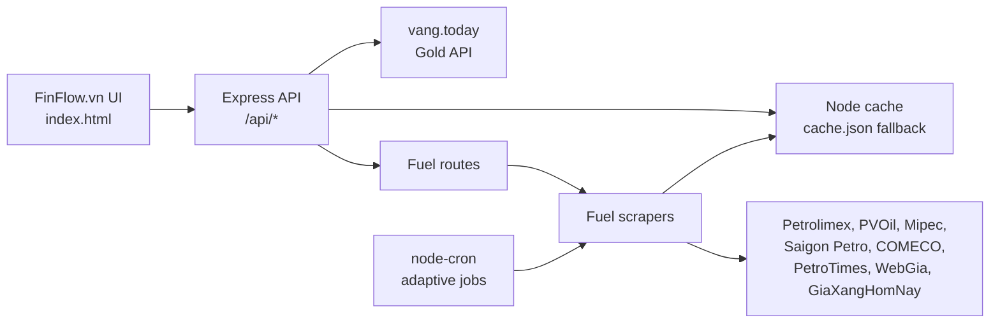

# FinFlow.vn - Vietnam Fuel API

> Dashboard tài chính Việt Nam kết hợp giao diện theo dõi thị trường với API dữ liệu xăng dầu và giá vàng.

FinFlow.vn giúp người dùng xem nhanh các chỉ số quan trọng như vàng, xăng dầu, chứng khoán, tỷ giá và lãi suất trong một giao diện rõ ràng, tối ưu cho cả desktop lẫn mobile. Phần backend cung cấp API Node.js để lấy giá xăng dầu từ nhiều nguồn công khai, cache dữ liệu, tra cứu theo tỉnh thành và đồng bộ giá vàng từ API bên ngoài.

<p align="center">
  
</p>

**Hình 1.** Giao diện tổng quan thị trường của FinFlow.vn.

## Điểm nổi bật

- Dashboard tài chính một màn hình: vàng, xăng dầu, chứng khoán, tỷ giá và lãi suất.
- API xăng dầu Việt Nam với dữ liệu tổng hợp từ nhiều nguồn công khai.
- Hỗ trợ tra cứu giá xăng dầu theo tỉnh thành qua slug.
- API giá vàng realtime với cache ngắn hạn để giảm tải nguồn dữ liệu.
- Adaptive cron theo lịch điều chỉnh giá xăng dầu tại Việt Nam: kiểm tra thưa hơn ngày thường, tăng tần suất quanh khung giờ công bố.
- Cache in-memory kết hợp fallback `cache.json`, giúp API vẫn có dữ liệu khi nguồn bên ngoài tạm lỗi.
- Express middleware cho CORS, compression, helmet và rate limit.
- Giao diện responsive, có bảng dữ liệu, thẻ tóm tắt, biểu đồ SVG và trạng thái đồng bộ API.

## Kiến trúc



## Công nghệ

| Thành phần | Công nghệ |
|---|---|
| Frontend | HTML, CSS, JavaScript thuần, SVG chart |
| Backend | Node.js, Express 5 |
| Scraping | Playwright, custom parsers |
| Cache | node-cache, `cache.json` fallback |
| Cron | node-cron, timezone `Asia/Ho_Chi_Minh` |
| Bảo vệ API | helmet, cors, compression, express-rate-limit |
| Test | Node test runner |

## Chạy local

Yêu cầu Node.js `>=18`.

```bash
git clone https://github.com/chidungho/vietfuel-api.git
cd vietfuel-api

npm --prefix "gia thi truong xang dau/vietfuel-api/backend" install
npm run browser:install
npm run dev
```

Sau khi chạy, mở:

```text
http://localhost:3000
```

Nếu chỉ muốn mở server nhanh mà không chạy cron/scraper nền ngay lúc khởi động:

```powershell
$env:SKIP_BOOTSTRAP_JOBS="true"
npm run dev
```

## API chính

| Method | Endpoint | Mô tả |
|---|---|---|
| GET | `/api/fuel-prices` | Trả bảng giá xăng dầu tổng hợp từ nguồn mặc định. |
| GET | `/api/fuel-prices?refresh=1` | Ép làm mới dữ liệu nguồn mặc định nếu có thể. |
| GET | `/api/fuel-prices/:source` | Lấy dữ liệu từ một nguồn cụ thể, ví dụ `pvoil` hoặc `petrolimex`. |
| GET | `/api/fuel-prices/province/:slug` | Tra cứu giá theo tỉnh thành, ví dụ `/api/fuel-prices/province/ha-noi`. |
| GET | `/api/gold-prices` | Lấy giá vàng từ nguồn API công khai và cache ngắn hạn. |
| GET | `/api/gold-prices?type=SJC` | Lọc giá vàng theo mã sản phẩm. |
| GET | `/api/provinces` | Danh sách tỉnh thành hỗ trợ tra cứu. |
| GET | `/api/sources` | Danh sách nguồn dữ liệu và trạng thái cache. |
| GET | `/api/health` | Kiểm tra trạng thái cache và endpoint hiện có. |

Nguồn xăng dầu hiện có: `petrolimex`, `kv2_petrolimex`, `saigon_petrolimex`, `vungtau_petrolimex`, `pvoil`, `mipec`, `comeco`, `saigonpetro`, `petrotimes`, `webgia`, `giaxanghomnay`.

## Biến môi trường

Không bắt buộc tạo `.env` để chạy mặc định. Các biến dưới đây dùng khi cần tùy chỉnh môi trường hoặc nguồn dữ liệu.

| Biến | Mặc định | Mục đích |
|---|---|---|
| `PORT` | `3000` | Cổng HTTP server. |
| `NODE_ENV` | `development` | Môi trường chạy ứng dụng. |
| `CACHE_TTL_MINUTES` | `60` | TTL cache xăng dầu. |
| `GOLD_API_URL` | `https://www.vang.today/api/prices` | Nguồn API giá vàng. |
| `GOLD_CACHE_TTL_SECONDS` | `300` | TTL cache giá vàng. |
| `SKIP_BOOTSTRAP_JOBS` | `false` | Bỏ qua scrape lần đầu và cron khi khởi động. |
| `CRON_SCHEDULE` | `0 * * * *` | Fallback schedule cho các logic cần cron tùy chỉnh. |
| `PETROLIMEX_URL`, `PVOIL_URL`, `MIPEC_URL`, ... | URL nguồn mặc định | Override nguồn scraper khi cần. |

Không commit file `.env` lên GitHub nếu trong đó có cấu hình riêng của môi trường triển khai.

## Cấu trúc thư mục

```text
.
├── README.md
├── docs/
│   └── preview.png
├── package.json
└── gia thi truong xang dau/
    ├── index.html
    └── vietfuel-api/
        └── backend/
            ├── config/
            ├── data/
            ├── routes/
            ├── services/
            ├── tests/
            ├── utils/
            ├── workers/
            ├── index.js
            └── server.js
```

## Kiểm thử

```bash
npm test
```

Lệnh test hiện trỏ về test suite của backend, gồm kiểm tra static frontend path và khả năng Express phục vụ trang `index.html`.

## Lưu ý dữ liệu

Dữ liệu được thu thập tự động từ website/API công khai và chỉ mang tính tham khảo. Dự án hoạt động độc lập, không đại diện cho bất kỳ doanh nghiệp, ngân hàng, sàn giao dịch hay cơ quan nhà nước nào.

## Tác giả

Chí Dũng - [github.com/chidungho](https://github.com/chidungho)

## License

MIT
